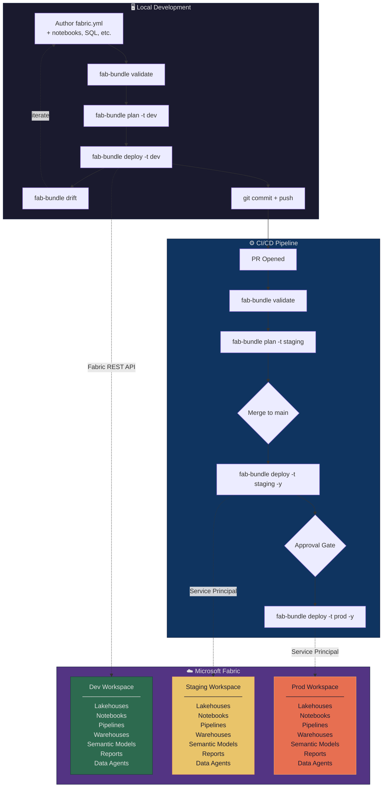

# Fabric Automation Bundles

[](https://pypi.org/project/fabric-automation-bundles/)
[](https://pypi.org/project/fabric-automation-bundles/)
[](https://github.com/dereknguyenio/fabric-automation-bundles/blob/main/LICENSE)
[](https://github.com/dereknguyenio/fabric-automation-bundles/actions)
[](https://dereknguyenio.github.io/fabric-automation-bundles/)

> **v1.0.0-beta** — 30 item types verified against live Fabric API. Production-ready for core workflows. [See what's tested.](#tested-item-types)

**Declarative project definitions for Microsoft Fabric.**

Define your entire Fabric project in a single `fabric.yml` — lakehouses, notebooks, pipelines, semantic models, Data Agents, security roles, and environment targets — then validate, plan, and deploy with a single command.

```bash
fab-bundle init --template medallion --name my-project
fab-bundle validate
fab-bundle plan
fab-bundle deploy -t prod
```

> **CLI naming:** The standalone CLI is `fab-bundle`. The long-term goal is integration as a `fab bundle` subcommand in the [Fabric CLI](https://github.com/microsoft/fabric-cli). Both syntaxes are shown in this documentation — use whichever applies to your installation.

## The Problem

Microsoft Fabric has no single declarative project definition. The Fabric CLI can export/import items, `fabric-cicd` can deploy across workspaces, and Terraform can provision infrastructure — but none of them describe:

- What resources your project needs (lakehouses, notebooks, pipelines, semantic models, Data Agents)
- How those resources depend on each other
- How configuration varies across environments (dev/staging/prod)
- What security roles and permissions are required
- How to deploy everything in the correct order

**Fabric Automation Bundles fills that gap.**

## Quick Start

### Install

```bash
pip install fabric-automation-bundles
```

### Create a New Project

```bash
# Medallion lakehouse architecture (bronze/silver/gold)
fab-bundle init --template medallion --name my-analytics

# OSDU + Fabric for Oil, Gas & Energy
fab-bundle init --template osdu_analytics --name my-osdu-project
```

### Or Generate from an Existing Workspace

```bash
fab-bundle generate --workspace "My Existing Workspace"
```

This scans the workspace and produces a `fabric.yml` you can customize — the fastest on-ramp for existing projects.

### Validate

```bash
fab-bundle validate
```

Validates all resource references, dependency chains, and target configurations.

### Plan (Dry-Run)

```bash
fab-bundle plan -t dev
```

Shows exactly what would change:

```
Deployment Plan: my-analytics
  Target:    dev
  Workspace: my-analytics-dev

  +  bronze-lakehouse      Lakehouse      create    New resource
  +  silver-lakehouse      Lakehouse      create    New resource
  +  gold-lakehouse        Lakehouse      create    New resource
  +  spark-env             Environment    create    New resource
  +  etl-bronze            Notebook       create    New resource
  +  etl-silver            Notebook       create    New resource
  +  daily-refresh         DataPipeline   create    New resource
  ~  analytics-model       SemanticModel  update    Definition updated

  Summary: 7 to create, 1 to update
```

### Deploy

```bash
fab-bundle deploy -t dev        # Deploy to dev (default)
fab-bundle deploy -t staging    # Deploy to staging
fab-bundle deploy -t prod -y   # Deploy to prod (skip confirmation)
```

### Destroy

```bash
fab-bundle destroy -t dev       # Tear down dev environment
```

## The `fabric.yml` Format

```yaml
bundle:
  name: my-analytics
  version: "1.0.0"

workspace:
  capacity_id: "your-fabric-capacity-guid"

resources:
  environments:
    spark-env:
      runtime: "1.3"
      libraries: [semantic-link-labs]

  lakehouses:
    bronze:
      description: "Raw data landing zone"
    gold:
      description: "Business-ready datasets"

  notebooks:
    etl-pipeline:
      path: ./notebooks/etl.py
      environment: spark-env
      default_lakehouse: bronze

  pipelines:
    daily-refresh:
      schedule:
        cron: "0 6 * * *"
        timezone: America/Chicago
      activities:
        - notebook: etl-pipeline

  semantic_models:
    analytics-model:
      path: ./semantic_model/
      default_lakehouse: gold

  reports:
    dashboard:
      path: ./reports/dashboard/
      semantic_model: analytics-model

  data_agents:
    my-agent:
      sources: [gold]
      instructions: ./agent/instructions.md
      few_shot_examples: ./agent/examples.yaml

security:
  roles:
    - name: engineers
      entra_group: sg-data-eng
      workspace_role: contributor
    - name: analysts
      entra_group: sg-analysts
      workspace_role: viewer

targets:
  dev:
    default: true
    workspace:
      name: my-analytics-dev
      capacity_id: "your-dev-capacity-guid"

  prod:
    workspace:
      name: my-analytics-prod
    run_as:
      service_principal: sp-fabric-prod
```

## How It Works

### Dependency Resolution

Fabric Automation Bundles automatically determines deployment order using topological sorting. You never have to think about what goes first:

```
environments → lakehouses → notebooks → pipelines
                          → warehouses
                          → semantic_models → reports
                          → data_agents
```

### Variable Substitution

Use `${var.name}` in any string value:

```yaml
variables:
  adme_endpoint:
    description: "ADME endpoint"
    default: "https://dev.energy.azure.com"

targets:
  prod:
    variables:
      adme_endpoint: "https://prod.energy.azure.com"
```

### Include Files

Split large bundles across multiple files:

```yaml
include:
  - resources/notebooks.yml
  - resources/pipelines.yml
  - security.yml
```

## Developer Workflow & CI/CD Architecture



### How `fab-bundle` fits in the pipeline

| Stage | Command | What happens |
|-------|---------|--------------|
| Local dev | `fab-bundle validate` | Schema validation, reference checks, dependency resolution |
| Local dev | `fab-bundle plan -t dev` | Connects to Fabric, diffs desired vs actual state |
| Local dev | `fab-bundle deploy -t dev` | Creates/updates resources in dev workspace |
| Local dev | `fab-bundle drift` | Detects out-of-band changes made in the portal |
| PR check | `fab-bundle validate` | Gate: blocks merge if bundle is invalid |
| PR check | `fab-bundle plan -t staging` | Informational: shows what the merge will change |
| CI deploy | `fab-bundle deploy -t staging -y` | Auto-deploys on merge, service principal auth |
| CI deploy | `fab-bundle deploy -t prod -y` | Deploys after manual approval gate |

### GitHub Actions

Copy `cicd/github-actions.yml` to `.github/workflows/fabric-bundle.yml`:

```yaml
- name: Deploy to Fabric
  run: |
    pip install fabric-automation-bundles
    fab-bundle deploy -t prod -y
  env:
    AZURE_TENANT_ID: ${{ secrets.AZURE_TENANT_ID }}
    AZURE_CLIENT_ID: ${{ secrets.AZURE_CLIENT_ID }}
    AZURE_CLIENT_SECRET: ${{ secrets.AZURE_CLIENT_SECRET }}
```

### Azure DevOps

Copy `cicd/azure-devops.yml` to your repo as a YAML pipeline — includes validate, staging, and production stages with approval gates.

## CLI Reference

| Command | Description |
|---------|-------------|
| `fab-bundle init` | Create a new project from a template |
| `fab-bundle validate` | Validate the bundle definition |
| `fab-bundle plan` | Preview changes (dry-run) |
| `fab-bundle deploy` | Deploy to a target workspace |
| `fab-bundle destroy` | Tear down bundle resources |
| `fab-bundle generate` | Generate fabric.yml from existing workspace |
| `fab-bundle run <resource>` | Run a notebook or pipeline |
| `fab-bundle list` | List available templates |
| `fab-bundle bind` | Bind an existing workspace item |
| `fab-bundle drift` | Detect drift between deployed state and live workspace |

### Common Flags

| Flag | Description |
|------|-------------|
| `-f, --file` | Path to fabric.yml (default: auto-detect) |
| `-t, --target` | Target environment (dev, staging, prod) |
| `-y, --auto-approve` | Skip confirmation prompts |
| `--dry-run` | Preview without making changes |

## Templates

### `medallion`
Bronze/Silver/Gold lakehouse architecture with:
- Three lakehouses with ETL notebooks
- Data pipeline with dependency chaining
- Semantic model and dashboard
- Data Agent with few-shot examples
- Security roles for engineers and analysts
- Dev/Staging/Prod targets

### `osdu_analytics`
OSDU on Fabric for Oil, Gas & Energy:
- ADME integration with OSDU Search API ingestion
- Well/Wellbore/Production entity flattening
- SQL views for BI (well master, production trends, field rollups)
- Data Agent with petroleum engineering context
- Industry-specific few-shot examples (GOR, water cut, decline analysis)
- ADME connection config per environment

### Custom Templates

Create your own templates by adding a directory to `fab_bundle/templates/` with a `template.yml` and a `fabric.yml`.

## Supported Resource Types

**45 item types** across all Fabric workloads:

| Category | Types |
|----------|-------|
| Data Engineering | Lakehouse, Notebook, Environment, SparkJobDefinition, GraphQLApi, SnowflakeDatabase |
| Data Factory | DataPipeline, CopyJob, MountedDataFactory, ApacheAirflowJob, dbt Job |
| Data Warehouse | Warehouse, SQLDatabase, MirroredDatabase, MirroredWarehouse, MirroredDatabricksCatalog, CosmosDB, Datamart |
| Power BI | SemanticModel, Report, PaginatedReport, Dashboard, Dataflow |
| Data Science | MLModel, MLExperiment |
| Real-Time Intelligence | Eventhouse, Eventstream, KQLDatabase, KQLDashboard, KQLQueryset, Reflex, DigitalTwinBuilder, DigitalTwinBuilderFlow, EventSchemaSet, GraphQuerySet |
| AI & Knowledge | DataAgent, OperationsAgent, AnomalyDetector, Ontology |
| Other | VariableLibrary, UserDataFunction, Graph, GraphModel, Map, HLSCohort |

Plus **OneLake Shortcuts** (ADLS, S3, cross-workspace) as lakehouse sub-resources.

See the [Resource Types Guide](https://dereknguyenio.github.io/fabric-automation-bundles/guide/resource-types/) for full details.

## Authentication

Fabric Automation Bundles uses `azure-identity` for authentication:

```bash
# Interactive (development)
az login
fab-bundle deploy -t dev

# Service Principal (CI/CD)
export AZURE_TENANT_ID=...
export AZURE_CLIENT_ID=...
export AZURE_CLIENT_SECRET=...
fab-bundle deploy -t prod -y
```

## VS Code Integration

Get autocomplete and validation for `fabric.yml` by adding a `.vscode/settings.json`:

```json
{
    "yaml.schemas": {
        "./fabric.schema.json": "fabric.yml"
    }
}
```

Requires the [YAML extension](https://marketplace.visualstudio.com/items?itemName=redhat.vscode-yaml).

## Architecture

```
fab_bundle/
├── cli.py                 # Click CLI (init, validate, plan, deploy, destroy, generate, run, drift)
├── models/
│   └── bundle.py          # 30+ Pydantic models for fabric.yml schema
├── engine/
│   ├── loader.py          # YAML parser with includes + variable substitution
│   ├── resolver.py        # Topological dependency sort
│   ├── planner.py         # Diff engine (desired state vs workspace state)
│   ├── deployer.py        # Executes plans via Fabric REST API
│   ├── state.py           # Deployment state tracking + drift detection
│   └── secrets.py         # Secrets resolution (env vars + Azure KeyVault)
├── providers/
│   └── fabric_api.py      # Fabric REST API client (workspace, items, git, connections, jobs)
├── generators/
│   ├── reverse.py         # Generate fabric.yml from existing workspace
│   └── templates.py       # Template engine with Jinja2
└── templates/
    ├── medallion/          # Bronze/Silver/Gold template
    └── osdu_analytics/     # OSDU + Fabric for OGE
```

## Contributing

Contributions welcome. See [CONTRIBUTING.md](CONTRIBUTING.md) for details.

```bash
git clone https://github.com/dereknguyenio/fabric-automation-bundles.git
cd fabric-automation-bundles
pip install -e ".[dev]"
pytest
```

## Tested Item Types

30 item types verified against a live Fabric workspace:

| Status | Item Types |
|--------|-----------|
| **Verified** (30) | Lakehouse, Notebook, DataPipeline, Warehouse, Environment, DataAgent, Eventhouse, KQLDatabase, KQLDashboard, KQLQueryset, Eventstream, Reflex, MLModel, MLExperiment, SparkJobDefinition, GraphQLApi, CopyJob, ApacheAirflowJob, Ontology, VariableLibrary, SQLDatabase, CosmosDBDatabase, MirroredAzureDatabricksCatalog, OperationsAgent, AnomalyDetector, DigitalTwinBuilder, GraphQuerySet, GraphModel, Map, UserDataFunction |
| **Capacity-gated** (4) | DataBuildToolJob, Graph, HLSCohort, EventSchemaSet |
| **Needs config** (2) | SnowflakeDatabase, DigitalTwinBuilderFlow |
| **List-only** (5) | Datamart, Dashboard, MirroredWarehouse, PaginatedReport, Dataflow |
| **Needs definition files** (4) | SemanticModel (TMDL), Report (PBIR), MirroredDatabase, MountedDataFactory |

## Feature Stability

| Feature | Status | Notes |
|---------|--------|-------|
| validate, plan, deploy, destroy | **Stable** | Tested end-to-end against live API |
| drift, status, diff, history, doctor | **Stable** | Tested against live workspaces |
| run (notebooks/pipelines) | **Stable** | Job submission works, LRO tracking limited |
| Security roles (workspace) | **Stable** | Entra user/group GUIDs |
| Incremental deploy (hash-based) | **Stable** | Skips unchanged resources |
| Deployment locking | **Stable** | Local + remote (blob lease) |
| CI/CD (GitHub Actions) | **Stable** | [Proven end-to-end](https://github.com/dereknguyenio/fabric-fab-cicd-example) |
| Remote state (OneLake, Blob, ADLS) | **Beta** | Built, not yet tested live |
| MCP server | **Beta** | 12 tools verified locally |
| OneLake data access roles | **Beta** | Built, not yet tested live |
| Environment publish (libraries) | **Beta** | Fire-and-forget, can't track completion |
| watch, promote, canary | **Experimental** | Built, untested |
| Notifications (Slack/Teams) | **Experimental** | Built, untested |
| Policy enforcement | **Experimental** | Built, untested |
| Shortcut transformations | **Experimental** | Model defined, API untested |

## License

MIT
